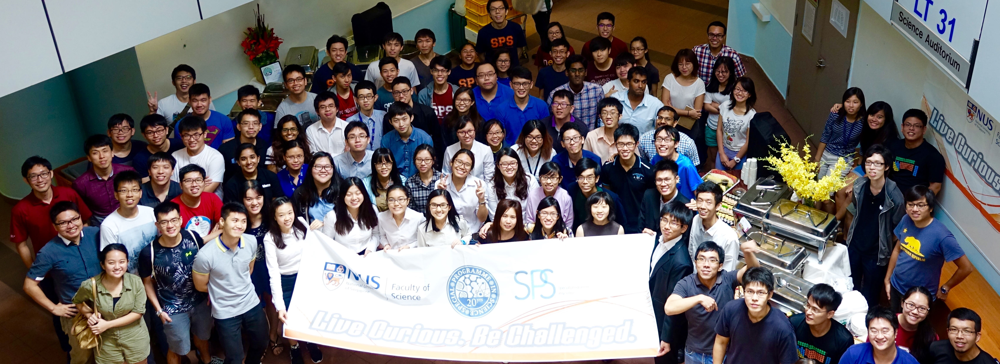

```{r include=FALSE, cache=FALSE}
# example R options set globally
options(width = 60)

# example chunk options set globally
knitr::opts_chunk$set(
  comment = "#>",
  collapse = F
  )
counter_exercises <- 0
counter_exercises_all <- 0
counter_examples <- 0
counter_examples_all <- 0

my_fun <- list(counter_exercises = 0)
class(my_fun) <- "My Functions"

# To keep track of the exercises
my_fun.example <- function(text, reset, same = F){
   if(!missing(reset)){
        counter_examples <<- 0
      }

  if (same){

  }else{
    counter_examples <<- counter_examples + 1
    counter_examples_all <<- counter_examples_all + 1
  }

  return(paste('### <span class = "my-examples">Example ',counter_examples,'| </span>',text,'{.unnumbered .panelset}\n'))
}

# To keep track of the examples
my_fun.exercise <- function(text, reset, same = F){
   if(!missing(reset)){
        counter_exercises <<- 0
      }

  if (same){

  }else{
    counter_exercises <<- counter_exercises + 1
    counter_exercises_all <<- counter_exercises_all + 1
  }

  return(paste('### <span class = "my-exercises">Exercise ',counter_exercises,'| </span>',text,'{.unnumbered .panelset}\n'))
}


# Additional Tabbing
my_fun.tab <- function(text){

  return(paste('### <span class = "tabbing-section"></span>',text,'{.unnumbered .panelset}\n'))
}
```

```{r setup, include = F}
# Visit https://yihui.org/knitr/options/#text-output for the meanings of the following options
knitr::opts_chunk$set(
  echo = T,
  message = F,
  warning = F,
  error = F,
  comment = '---',
  collapse = F,
  strip.white = F,
  prompt = F,
  highlight = T,
  cache = F,
  size = 'normalsize',
  # background = '#FFFFFF',
  # engine = 'python'
  # class.source = 'rrrr'
  tidy = T,
  tidy.opts = list(blank = F, width.cutoff = 100),
  fig.width = 4,
  R.options = list(width = 220),
  fig.align = 'center',
  out.width = "85%"
)

xaringanExtra::use_panelset()

library(reticulate)
library(readr)
library(kableExtra)

if (Sys.info()['user'] == 'chammika') {
  use_python('/home/chammika/miniconda3/bin/python')
} else if (Sys.info()['user'] == 'Darren Teo') {
  use_python('D:\\minconda')
} else {
  use_python('D:\\minconda')
}
```

<!-- Dirty way to force Bookdown to include the folder python_outputs -->
<!--  -->

`# (PART) Welcome {-}`

# Welcome to...


<div class = "front-title">
<span style = "color:#096B72;opacity:.75;">TFI eWorkshop </span> | Using Python To Tell Stories With Data
</div>

```{r,echo = F,out.width = "100%"}

```

## About this eWorkshop {.unnumbered .panelset}

### Abstract {.unnumbered}

<br>
Data is all-powerful; it can make or break scientific theories and cast far-reaching influence on, for example, our beliefs and society. A pertinent example is the use (and misuse) of data in the handling of the COVID-19 pandemic. All this has highlighted the need to, at least, teach simple analytical and visualisation skills and tools to gain insights from data.

Python is a friendly, extremely popular and powerful computational language that is free. Python is versatile and can be used for simple visualisation and analytical tasks or even to interrogate big data sets.  This workshop will gently guide you to using Python to visualise data and to make simple statistical queries. This will equip you and your students with a powerful computational tool that can readily be used to gain insight into scientific data. Learning Python will also open other endless computational possibilities (e.g. machine learning, image analysis).

No prior programming knowledge is expected, just lots of enthusiasm and a sense of humour.

### Workflow {.unnumbered}

<br>

```{r workshop-worksflow,echo = F,eval=T}
filename <- "./files/2021 _ Planning - Python Workshop _ Workflow.csv"
df <- read_csv(filename, col_types = cols(Time = col_character(), Duration = col_skip()), na = "empty")

df %>%
  kbl() %>%
  kable_paper("hover", full_width = T) %>%
  collapse_rows(columns = 1:2)
```

<!-- <div class = "front-table"> -->

<!-- |        Dates        |       Part      |          | Things to do                                                            | -->
<!-- | :-----------------: | :-------------: | :------: | ----------------------------------------------------------------------- | -->
<!-- | September 4 Onwards | Before Workshop |          | Create (free) Google Account                                            | -->
<!-- |                     |                 |          | Watch 10 min video to learn the basics of Python                        | -->
<!-- |                     |                 |          | Practice exercises for Python basics                                    | -->
<!-- |                     |                 |          | Watch 15 min video to learn the basics of Pandas                        | -->
<!-- |                     |                 |          | Practice exercises for Pandas basics                                    | -->
<!-- |     September 11    |     Workshop    | 10:00 AM | Introduction to SPS and the Workshop                                    | -->
<!-- |                     |                 | 10:15 AM | Basic plotting using matplotlib                                         | -->
<!-- |                     |                 | 11:00 AM | Exploratory Analysis + Visualistion using Pandas                        | -->
<!-- |                     |                 | 11:45 AM | Analysing COVID-19 data using Pandas                                    | -->
<!-- |                     |                 | 12:30 PM | Core visualisation concepts                                             | -->
<!-- |                     |                 | 12:45 PM | Discussion. Survey (About workshop, requests & possible collaborations) | -->
<!-- |                     |                 |  1:00 PM | Workshop ends                                                           | -->

<!-- </div> -->

-   We will email the participants more details, closer to the date of the workshop.

### Aims & Objectives {-}

#### Aims {-}

1.  To help those of you who want to start programming to get started.
    -   We do not expect your code to be super-efficient; it just needs to work. Perfection can come later.
    -   You can borrow code from the internet but you should at least know **what**  it is doing even if you do not know **how**.
2.  Learn the least amount of code and concepts that can achieve the most common tasks related to data visualisation.
    In particular, we will focus on code related to:
    -   basic Python
    -   handling data
    -   plotting.


#### Objectives {-}

By the end of this workshops, you will be able to:

1. Use Python (matplotlib) to produce high quality plots
1. Use Python (pandas) to query simple datasets
1. Use Python (pandas + matplotlib) to produce visualisations of COVID-19 data.
1. Indentify and apply core principles for effective visualisation of data.

### Supporting Institutions  {.unnumbered}

<br>

-   Temasek Foundation International (TFI)
-   National University of Singapore (NUS)
    -   Special Programme in Science (SPS, [sps.nus.edu.sg](http://sps.nus.edu.sg))
    -   Science Communication Programme, Faculty of Science

<!--chapter:end:index.Rmd-->

```{r include=FALSE, cache=FALSE}
# example R options set globally
options(width = 60)

# example chunk options set globally
knitr::opts_chunk$set(
  comment = "#>",
  collapse = F
  )
counter_exercises <- 0
counter_exercises_all <- 0
counter_examples <- 0
counter_examples_all <- 0

my_fun <- list(counter_exercises = 0)
class(my_fun) <- "My Functions"

# To keep track of the exercises
my_fun.example <- function(text, reset, same = F){
   if(!missing(reset)){
        counter_examples <<- 0
      }

  if (same){

  }else{
    counter_examples <<- counter_examples + 1
    counter_examples_all <<- counter_examples_all + 1
  }

  return(paste('### <span class = "my-examples">Example ',counter_examples,'| </span>',text,'{.unnumbered .panelset}\n'))
}

# To keep track of the examples
my_fun.exercise <- function(text, reset, same = F){
   if(!missing(reset)){
        counter_exercises <<- 0
      }

  if (same){

  }else{
    counter_exercises <<- counter_exercises + 1
    counter_exercises_all <<- counter_exercises_all + 1
  }

  return(paste('### <span class = "my-exercises">Exercise ',counter_exercises,'| </span>',text,'{.unnumbered .panelset}\n'))
}


# Additional Tabbing
my_fun.tab <- function(text){

  return(paste('### <span class = "tabbing-section"></span>',text,'{.unnumbered .panelset}\n'))
}
```
# The Power of Dataframes

```{r, echo=F}
file_link <-"https://raw.githubusercontent.com/nus-sps/workshops.tfi.data-visualisation/main/files/dummy_class.xls"
```

In this day and age of ‘big data,’ it almost an oxymoron to claim that ‘data analysis skills are important, relevant and useful.’ In this section, we will start using Pandas which is Python’s de-facto module for data analysis. In addition to using Pandas you will see how immensely efficient it is to have your data in a dataframe than in a spreadsheet.

## Just enough {-}
Pandas offer several ways (i.e. different syntaxes) to achieve a specific goal. We will not cover all of these. Instead, we will only highlight a minimally sufficient set of syntax and instructions.

To learn the power of Pandas, we will use a dataset of test scores for a dummy class. You can access the data at `r file_link`.


`r my_fun.exercise('Uploding Files to Colab')`

#### Task {-}

Although Pandas can read the file directly over the internet, it will be good for us to learn how to upload files to Colab.<br>
So,

1. Download the `xls` file from the following link by right-clicking and using 'Save as...'<br>
`r file_link`.
1. Upload the file to Colab.
1. Use the following code to read the file into Pandas.

    ```{python,eval=F}
    import pandas as pd
    pd.read_excel('dummy_class.xls')
    ```

  Now we are ready to start exploring the Pandas by exploring the dataset. It is best practice to first understand what kind of dataset you are dealing with. So, lets do some data 'house keeping'!

`r my_fun.exercise('Uploding Files to Colab')`

```{python,results='asis',echo=F,cache=F}
from my_functions import render_python
print(render_python('dummy-class_housekeeping.py'))
```

<!--chapter:end:files_rmd/01_pre-workshop_02_basic-pandas.Rmd-->

